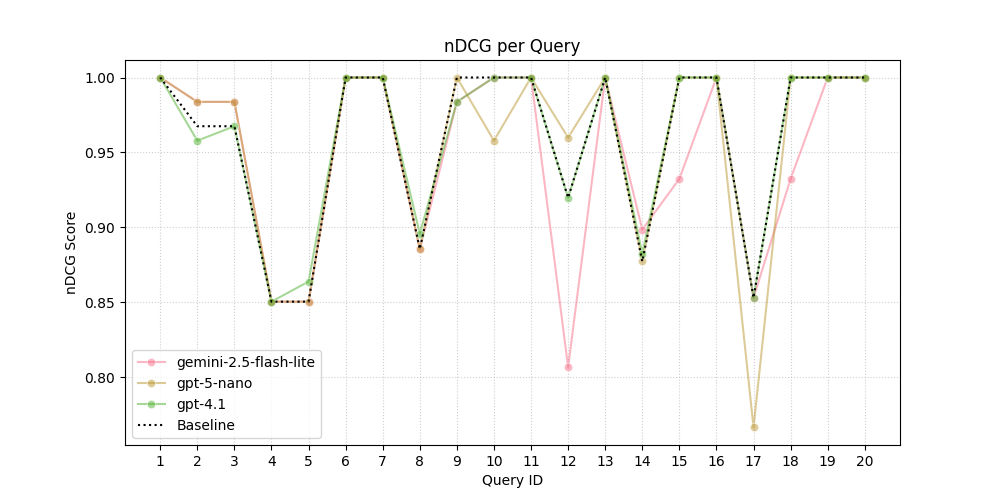

## Attempt #1

**Prompt**

> Analyze the query and candidate text, then rate how relevant the candidate text is to the query below on a scale from **0 (not relevant)** to **1 (perfectly relevant)**.

**nDCG Results**

| Model                    | nDCG Score |
|---------------------------|------------:|
| baseline             | 0.958547 |
| gemini-2.5-flash-lite| 0.947997 |
| gpt-5-nano           | 0.955743 |
| gpt-4.1              | **0.958699** |

**Visualization**

