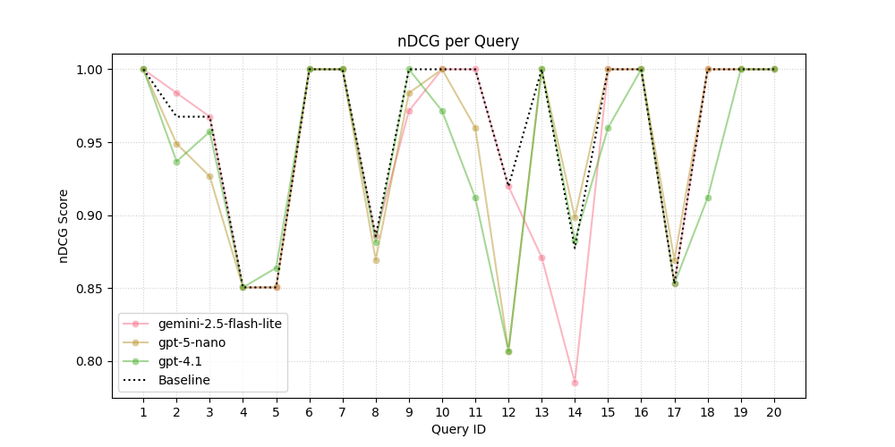
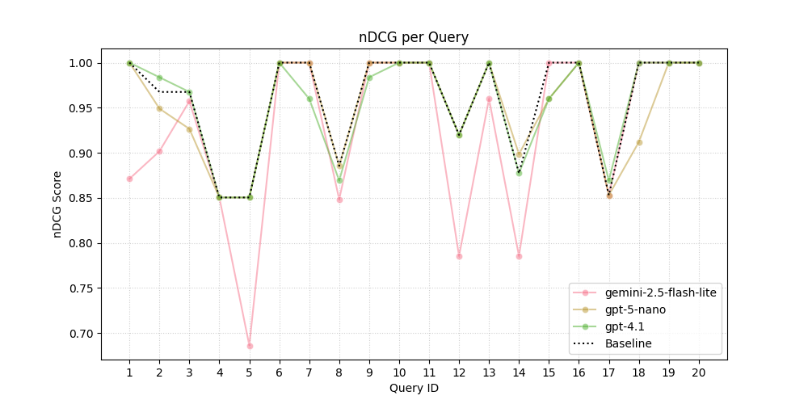

## Attempt #1
I chose this prompt because it briefly describes what I want to be accomplished.

**Prompt**

> Analyze the query and candidate text, then rate how relevant the candidate text is to the query below on a scale from **0 (not relevant)** to **1 (perfectly relevant)**.

**nDCG Results**

| Model                    | nDCG Score |
|---------------------------|------------:|
| baseline             | 0.958547 |
| gemini-2.5-flash-lite| 0.947997 |
| gpt-5-nano           | 0.955743 |
| gpt-4.1              | **0.958699** |

**Visualization**

## Attempt #2
I created this prompt thinking that breaking down the goal would be the easiest to get through. It sadly did not perform as well as Attempt #1.

**Prompt**

> PERSONA: You are a meticulous Search Quality Rater working for a major search engine.
> TASK: Analyze the query and candidate text. Evaluate the relevance of the provided candidate text to the give query on a scale from 0 (not relevant) to 1 (perfectly relevant).
> OUTPUT: only a number between 0 and 1.
> Query: {query}, Candidate: {candidate}

**nDCG Results**

| Model                    | nDCG Score |
|---------------------------|------------:|
| baseline             | **0.958547** |
| gemini-2.5-flash-lite| 0.946891 |
| gpt-5-nano           | 0.948157 |
| gpt-4.1              | 0.939321 |

**Visualization**

## Attempt #3
For this prompt I played around with the system vs user prompt. It surprisingly didn't do well as my original prompt. I believe it is becuase I outlined too many rules.

**Prompt**

> You are a TREC-style IR judge. Judge only topical relevance to the user's query.
    Rules:
    - Evaluate topicality/intent only (ignore style, length, grammar).
    - If the candidate is empty/boilerplate, score 0.0.
    Output: only a single number between 0 (off-topic, wrong, or non-responsive) and 1 (completely relevant). Prefer up to 2 decimal places.

**nDCG Results**

| Model                    | nDCG Score |
|---------------------------|------------:|
| baseline             | **0.958547** |
| gemini-2.5-flash-lite| 0.924898 |
| gpt-5-nano           | 0.950219 |
| gpt-4.1              | 0.954534 |

**Visualization**

