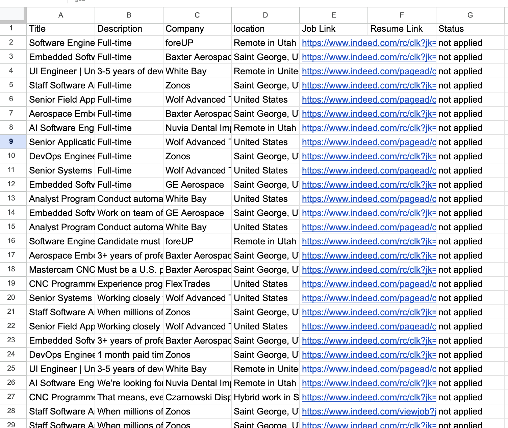

## Problem Description
For my project I want to create a ReAct agent that searches and analyzes job listings, tailors a resume to each job description for personalized applications, and keeps track of progress in my google drive.

- [Sheets Link](https://docs.google.com/spreadsheets/d/1SIYmwu69bMw8r-Ytk_TtD3l_IKL0f_qKwo4Q7DtBLLY/edit?usp=sharing)
- [Drive Link](https://drive.google.com/drive/folders/1vkbrWYq6sHhIYJj8rq86Anps7iN8nfjq?usp=sharing)
  
## PEAS
### Performance Measure
#### Application Quality
- Can find jobs that i'm qualified for
- Creates a personalized resume using a template depending on the job description (docx or pdf)
#### Efficiency
- Finds jobs that fit my interests 
- Does it save me time compared to me manually applying?
#### Results
- Keep track of possible employers in my google sheet correctly and accurately
- Does it get me any interviews?
### Enviroment
- My profile: experience, education, projects, skills, languages, job preferences
- External job sources: job boards, company career pages
- Google Sheet tracking jobs
- Resume template
### Actuators
- Editing Google sheet
- Rank job opportunities
- Generate Resume
### Sensors
- Scrape job postings
- Read and parse user profile data
- Read current contents of the Google Sheet
- Read resume templates

## Tools

### **1. Chrome Dev Tools MCP**
https://github.com/ChromeDevTools/chrome-devtools-mcp
* Scrape job descriptions

### **2. Google Sheets Tool**

* Append new job rows
* Update job status, resume links
* Retrieve jobs

### **3. Google Drive Tool**

* Upload DOCX/PDF resumes
* Return shareable Drive URLs
* Store all resumes under `JobAgent/Resumes/`
* Updates the sheet with the link

### **4. Resume Document Tool (Markdown + Pandoc)**

* Save generated resume content as Markdown
* Convert MD → DOCX/PDF (Pandoc)
* `FirstName_LastName_JobTitle.docx`
* Provide output paths for Drive upload

### **5. Profile Loader Tool**
* Provide structured representation of the user’s skills, experience, and preferences

## Agent Workflow
* Scrapes job postings
* Evaluates fit score
* Logs jobs into Google Sheet
* Generates tailored resumes
* Uploads resumes to Drive
* Marks jobs as **“Ready to Apply”**

try in this order: 
1. given a job description...
2. look at a specific company careers page {url or name}
3. search for companies in {city}

## Week 1 - Process
for most of my queries I say 
`Find software engineer jobs in St george utah`
### Scraping jobs using Chrome Dev Tools
So painful to figure out how to avoid captchas. After reading the documentation I could look more "human" after I ran this command in one shell `/Applications/Google\ Chrome.app/Contents/MacOS/Google\ Chrome --remote-debugging-port=9222 --user-data-dir=/tmp/chrome-profile-stable`. It just opens up a chrome browser but isn't tied to my personal data.
I got the command from [Step2](https://github.com/ChromeDevTools/chrome-devtools-mcp/tree/main?tab=readme-ov-file#user-data-directory)

This is the result I got:

**=== Final Answer ===**
---
I have found several software engineer jobs in and around St. George, Utah on Indeed.com.

Here is a summary of the job postings:

* **DevOps Engineer**
  * **Company:** Zonos  
  * **Location:** Saint George, UT 84770  
  * **Salary:** From $90,000 a year

* **Aerospace Embedded Software Engineer**
  * **Company:** Baxter Aerospace, Inc  
  * **Location:** Saint George, UT 84790  
  * **Salary:** Pay information not provided

* **Software Engineer**
  * **Company:** foreUP  
  * **Location:** Remote in Utah  
  * **Salary:** Pay information not provided

* **Flight Embedded Software Engineer**
  * **Company:** Baxter Aerospace, Inc  
  * **Location:** Saint George, UT 84790  
  * **Salary:** Pay information not provided

* **AI Software Engineer**
  * **Company:** Nuvia Dental Implant Center  
  * **Location:** Remote in Utah  
  * **Salary:** $140,000 - $220,000 a year

* **Staff Software Architect (aka Head Problem Solver)**
  * **Company:** Zonos  
  * **Location:** Saint George, UT 84770  
  * **Salary:** From $180,000 a year

* **Embedded Software Engineer**
  * **Company:** GE Aerospace  
  * **Location:** Saint George, UT 84790  
  * **Salary:** Pay information not provided

* **Cloud Engineer/Sr Developer**
  * **Company:** CGI Group, Inc.  
  * **Location:** Remote in United States  
  * **Salary:** $70,800 - $156,700 a year

You can view the full search results directly on Indeed here:  
https://www.indeed.com/jobs?q=software+engineer&l=St+George%2C+UT

### Resume tools
I realized my personal info is too long to paste directly in my prompt so I needed to create a tool where I can describe myself. I gave an LLM my resume and told it to create a json object and I saved it as my `profile.json`. The read profile tool just returns said json.

For the resume builder tool I mainly had a hard time with file naming and storage/retrieving.

### Creating Drive Tools
I used a few of google's quickstart examples as a canvas for my tools. I ran into issues with auth so I made a flag to regenerate the token.json. It was adding job listing like I wanted but the resumes wouldn't translate from md using pandoc. The generated md resume sounded SOLID (even I would hire me). At this point I haven't been able to test out my upload to docs tool.

### Optimized prompt

For a while it would take 20+ steps to scrape jobs but now it takes about 5! The mcp I'm using has a tool called [evaluate script](https://github.com/ChromeDevTools/chrome-devtools-mcp/blob/main/docs/tool-reference.md#evaluate_script). It's pretty dangerous because it can run javascript in the console of the DOM. In my prompt I added an example script with potentially useful selectors to do the scraping. Before it was producing garbage code and that's why it took so many tries.

---
### Results
**=== Final Answer ===**
>I found 15 software engineer jobs in St. George, Utah. I created a tailored resume for the "UI Engineer" position and uploaded it to Google Drive, updating the link in row 63 of your job sheet.

It actually did the thing! It only took 11 steps. I was a little disapointed with the resume. My first attempt (row 62 col E) was a lot more promising but still not perfect.

[Final docx resume](https://docs.google.com/document/d/1l3yusfLoomLyoLUmtuMycCADD2b-s3bi/edit?usp=drive_link&ouid=105910951170764711145&rtpof=true&sd=true)